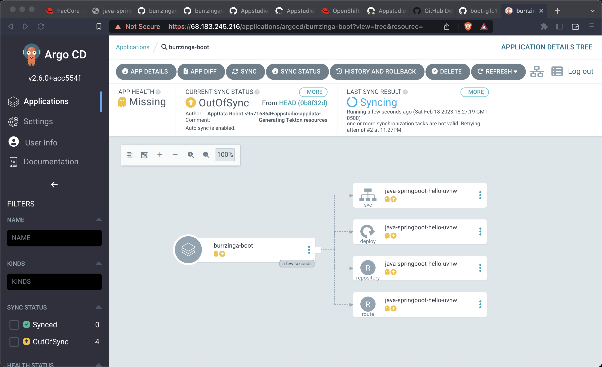

# ArgoCD Pull from Stonesoup

Stonesoup Gitops Repos

https://github.com/redhat-appstudio-appdata

```
doctl auth init
```

This will require a token

https://cloud.digitalocean.com/account/api/tokens


Do you have any clusters up?

```
doctl kubernetes cluster list
```

Do you have any load-balancers up?  These are a result from using Service type Load-Balancer

```
doctl compute load-balancer list
```

Download argocd binary

https://github.com/argoproj/argo-cd/releases

Important env vars to configure, making sure kubectl and argocd are in the PATH

```
export KUBE_EDITOR="code -w"
export PATH=~/devnation/bin:$PATH
```


Create a place for the KUBECONFIGs.  I like keeping my clusters separated via unique KUBECONFIGs

```
mkdir .kube
```

```
export KUBECONFIG=~/xKS/doks-argocd/.kube/config-amsterdam
```

```
export KUBECONFIG=~/xKS/doks-argocd/.kube/config-bengaluru
```

```
export KUBECONFIG=~/xKS/doks-argocd/.kube/config-newyork
```

Create the clusters, I do this in 3 different terminal sessions, to keep the environments nicely separated

```
doctl kubernetes cluster create amsterdam --version 1.24.12-do.0 --region ams3 --node-pool="name=worker-pool;count=3"
```

```
doctl kubernetes cluster create bengaluru --version 1.23.14-do.0 --region blr1 --node-pool="name=worker-pool;count=3"
```

```
doctl kubernetes cluster create newyork --version 1.23.14-do.0 --region nyc1 --node-pool="name=worker-pool;count=3"
```

Hub

```
doctl kubernetes cluster create toronto --version 1.24.12-do.0 --region tor1 --node-pool="name=worker-pool;count=3"
```

```
doctl kubernetes cluster list
```

```
ID                                      Name         Region    Version         Auto Upgrade    Status     Node Pools
e2b47ebf-093a-4ac4-be69-1fdaa3b3b4c0    bengaluru    blr1      1.23.14-do.0    false           running    worker-pool
```

If needed, overlay the per cluster $KUBECONFIG files

```
doctl k8s cluster kubeconfig show amsterdam >> $KUBECONFIG
```

```
doctl k8s cluster kubeconfig show bengaluru >> $KUBECONFIG
```

```
doctl k8s cluster kubeconfig show newyork >> $KUBECONFIG
```

```
doctl k8s cluster kubeconfig show toronto >> $KUBECONFIG
```

Discover API_URL

```
TOR_API_URL=$(doctl kubernetes cluster get toronto -o json | jq -r '.[].endpoint')
echo $TOR_API_URL
```

```
API_URL=$TOR_API_URL .create-secrets.sh
```

```
kubectl create namespace burrzinga-tenant
```

https://www.screencast.com/t/LmlUBHIiDG


Deploy ArgoCD. 

```
kubectl create namespace argocd
kubectl apply -n argocd -f https://raw.githubusercontent.com/argoproj/argo-cd/stable/manifests/install.yaml

kubectl patch svc argocd-server -n argocd -p '{"spec": {"type": "LoadBalancer"}}'
```

Wait for the external IP to be populated

```
watch kubectl get services argocd-server -n argocd
```

```
NAME            TYPE           CLUSTER-IP    EXTERNAL-IP      PORT(S)                      AGE
argocd-server   LoadBalancer   10.245.5.37   68.183.245.216   80:31643/TCP,443:30114/TCP   5m41s
```

Get the default password and IP address

```
ARGOCD_PASS=$(kubectl -n argocd get secret argocd-initial-admin-secret -o jsonpath="{.data.password}" | base64 -d)

ARGOCD_IP=$(kubectl -n argocd get service argocd-server -o jsonpath="{.status.loadBalancer.ingress[0].ip}"):80

echo $ARGOCD_IP

echo $ARGOCD_PASS
```

Open the browser to the correct address

```
open http://$ARGOCD_IP
```

Also login via the argocd CLI

```
argocd login --insecure --grpc-web $ARGOCD_IP  --username admin --password $ARGOCD_PASS
```

```
argocd cluster list
```

```
SERVER                          NAME        VERSION  STATUS   MESSAGE                                                  PROJECT
https://kubernetes.default.svc  in-cluster           Unknown  Cluster has no applications and is not being monitored.
```

Because of the .tekton directory in the Stonesoup gitops repo create some additional CRDs

????

```
kubectl apply --filename https://storage.googleapis.com/tekton-releases/pipeline/latest/release.yaml
```  

Create an Application

```
kubectl apply -f burrzinga-boot/Application.yaml
```





```
argocd app list
```

## Clean Up

Remove all clusters, save some money
```
doctl k8s cluster delete toronto
doctl k8s cluster delete bengaluru
doctl k8s cluster delete amsterdam
doctl k8s cluster delete newyork
```

Remove all load-balancers, those seem to hang around even when clusters are deleted
```
doctl compute load-balancer list
doctl compute load-balancer delete 1069dd38-35e8-4f6a-a968-408ff86b78c6
```
